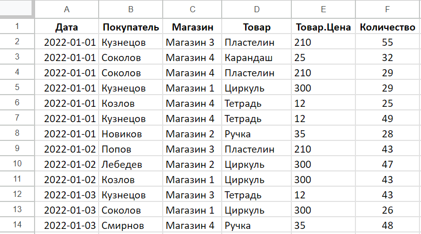

# Retail Company BI Platform Data Generator

## About this repo

This project is a part of my diploma (vkr). It is a tool that provides an opportunity 
to create test data in .xlsx format (Excel-files).

The main project repo: https://github.com/nnndk/retail-company-bi-platform

## How to use

To create an Excel file, run src/main.py. There is a function that creates an example-file. 
You can copy its structure and set your own test data.

Below you can find an example of generated data. This is a screenshot from the file generated_files/sales_data.xlsx
